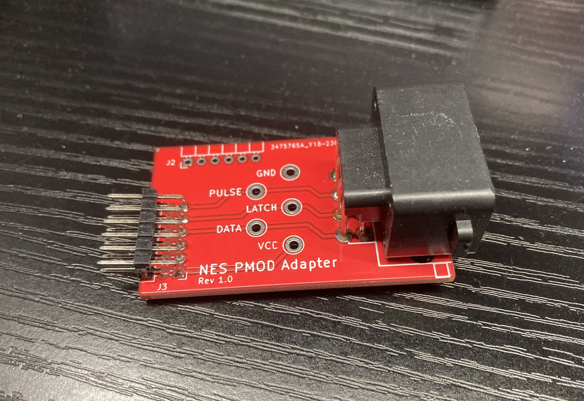

# NES Controller PMOD Adapter
Design by Jamal Bouajjaj

This adapter board was designed for the University of New Haven's ELEC4475/ELEC6659 System-On-Chip courses, where an NES controller (or clones of it) are connected to a Digilent Spartan development board.

This board adapts an NES controller to a PMOD connector.

The unused pins in the PMOD connection are routed out to a 1 row PMOD connector on the side.

# Diagram Drawing

A diagram of the pinout is available in the folder [diagram](diagram/PinoutDiagram.pdf)

# License
This project, including the board and documentation, are all under a GPLv3 license.
